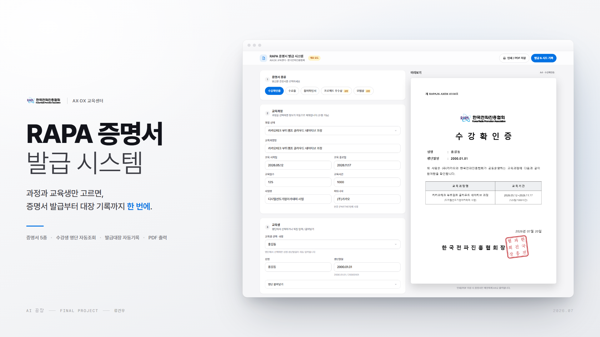

# RAPA 증명서 발급 시스템



> **훈련생 명단 확인부터 증명서 작성·채번·발급대장 기입까지 전부 수기로 하던 증명서 발급을,
> 고용24(HRD-Net) 기관 API에 직접 연결해 「과정 선택 → 교육생 선택 → 발급」 한 흐름으로 끝내고,
> 그 결과가 구글시트 발급대장에 자동으로 한 줄 쌓이게 한다.**

한국전파진흥협회(RAPA) AX·DX 교육센터에서 **실제 운영 중인** 사내 도구입니다.
쓰는 사람은 교육사업 담당자 본인이고, 2026-07-13 기준 **누적 720건**을 발급했습니다.

---

## 무엇이 바뀌었나

| 단계 | 이전 (전부 수기) | 지금 (앱) |
|---|---|---|
| 훈련생 명단 확보 | 명단 파일을 찾아 열거나 담당자에게 요청 | 과정을 고르면 **고용24 기관전용 API가 이름·생년월일 자동 조회** |
| 성명·생년월일 입력 | 보고 옮겨 적음 ← **오타 발생 지점** | 드롭다운에서 고르면 채워짐. **타이핑 0** |
| 과정 정보(기간·일수·시간·사업명) | 공문·사업계획서에서 찾아 옮겨 적음 | 고용24 과정상세로 **자동 채움** |
| 증명서 번호 채번 | 대장에서 마지막 번호를 눈으로 확인해 +1 ← **중복 발생 지점** | **서버가 대장을 읽어 자동 채번** (`RAPA26-AXDX-####`) |
| 증명서 작성 | 양식 파일에 직접 타이핑 | 입력값이 **공식 A4 양식에 실시간 렌더링** |
| 발급대장 기입 | 발급 후 시트에 손으로 한 줄 추가 ← **누락 발생 지점** | **발급 = 시트 기록.** 클릭 한 번에 1행 자동 누적 |
| 출력 | 인쇄 | 인쇄 / PDF 저장 |

수기 7단계가 사라지고, 사람이 내리는 판단은 **"누구에게, 어떤 증서를"** 둘만 남았습니다.

**증명서 5종** — 수강확인증(주력) · 수료증 · 참여확인서 · 프로젝트 우수상 · 모범상
**운영 실적** — 누적 720건 발급, 다음 번호 `RAPA26-AXDX-0721`, **번호 중복 0건** (2026-07-13 실측)

---

## 데모 · 증빙

| 항목 | 파일 |
|---|---|
| 시연 영상 | `RAPA/demo/demo.mp4` — **로컬 전용.** 실제 훈련생 명단 화면이 담겨 있어 공개 저장소에서 제외 ([`.gitignore`](RAPA/.gitignore)) |
| 실사용자 피드백 | [`피드백 스크린샷_1.png`](피드백%20스크린샷_1.png) — *"오늘 수강확인증으로 처음 주신 폼 써봤는데 아주 잘 되고 아주 편합니다"* (2026-07-16) |
| 본인 외 배포 | [`본인 외 배포 스크린샷_1.png`](본인%20외%20배포%20스크린샷_1.png) — 교육센터 구성원 대상 배포 |
| 제작 과정 | `대화 스크린샷_1~4.png` |

## 구조

```
[index.html · 정적 단일 파일]  ──fetch──▶  [Apps Script 웹앱(Code.gs)]  ──▶  [구글시트 발급대장]
   좌: 입력폼 / 우: 증명서 실시간 미리보기      ├─ 고용24 과정상세 · 수강생 명단
                                            └─ 발급 1건 = 시트 1행 누적
```

**서버가 없습니다.** 정적 HTML + Apps Script + 구글시트가 전부입니다.
고용24 `authKey`는 Apps Script 스크립트 속성에만 있고 프런트에 노출되지 않습니다.

→ 설치·배포 절차와 보안 경계는 [`RAPA/README.md`](RAPA/README.md)

## 기획 문서

| 문서 | 내용 |
|---|---|
| [MISSION.md](../../week_6/3_Planning_개인_프로젝트/MISSION.md) | 미션 정의, 현재 상태(v1), v2 갭 분석 |
| [DEV.md](../../week_6/3_Planning_개인_프로젝트/DEV.md) | 개발 구조 선택과 TODO |
| [AUDIENCES.md](../../week_6/3_Planning_개인_프로젝트/AUDIENCES.md) | 사용자 정의 |
| [research.md](../../week_6/3_Planning_개인_프로젝트/research.md) | 경쟁 SaaS 4곳 조사 — 왜 사서 쓰지 않는가 |

---

## 회고

### 잘된 점

증명서 한 장을 내보내는 데 필요한 일곱 단계가 전부 수기였다. 명단에서 이름과 생년월일을 찾아 옮겨 적고, 양식에 타이핑하고, 대장에서 마지막 번호를 눈으로 확인해 다음 번호를 붙이고, 출력한 뒤 대장에 한 줄을 손으로 기입했다. **옮겨 적는 자리마다 오타가 났고, 눈으로 매기는 번호는 겹쳤다.** 한 번 나간 공식 문서는 회수할 수 없으니 이건 번거로움이 아니라 실제 리스크였다. 고용24 기관 API에 직접 붙어 명단을 당겨오고 채번과 대장 기입을 서버에 맡기면서, **사람이 옮겨 적는 단계가 아예 사라졌다.** 720건을 발급하는 동안 번호 중복은 한 건도 없었고, 건당 몇 분씩 걸리던 작업이 클릭 몇 번으로 끝난다. 수강확인증처럼 수시로 요청이 들어오는 증서일수록 절약 폭이 컸다.

### 아쉬운 점

**수료증은 끝까지 자동화하지 못했다.** 디지털선도기업아카데미 사업의 수료증은 선도기업과 RAPA의 공동 발행 문서인데, 선도기업 직인은 우리가 보관할 수 있는 물건이 아니다. 앱이 아무리 깔끔하게 뽑아줘도 **선도기업 날인을 받는 후작업은 구조적으로 남는다.** 여기에 시간이 부족해 과정마다 다른 선도기업 로고를 양식에 얹는 작업까지는 손대지 못했고, 그래서 수료증은 당분간 메일머지를 병행해야 한다. 다만 이건 방향이 틀린 게 아니라 진도의 문제다. 핵심 파이프라인(API 명단 조회 → 발급 → 대장 자동 기록)은 720건으로 이미 검증됐으니, 그 위에 **선도기업 로고·2단 서명란을 반영한 공식 수료증 템플릿**과 **40명 일괄 발급**을 차례로 붙여 안정적으로 보완해 나갈 계획이다.
