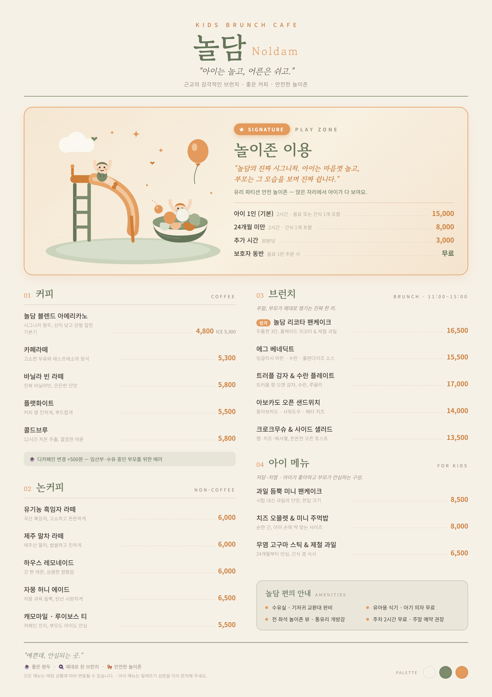

# 놀담 · Noldam

### *"아이는 놀고, 어른은 쉬고."*

**키즈 브런치 카페 — MENU**

`A4 · 인쇄용` &nbsp;·&nbsp; 2480 × 3508 px (A4 세로 · 300dpi)

---

## 🎨 디자인 시스템

컨셉 &mdash; *근교의 감각적인 모던·미니멀 공간, 화이트·파스텔, 유치하지 않게.*
이 감성을 3색 팔레트와 2개 폰트로 정리하고, **A4 인쇄 판형(210:297)에 맞춰 2단 그리드**로 재구성했습니다.

### 컬러 팔레트 (3색)

| 색 | 이름 | HEX | 역할 |
|:--:|:--|:--:|:--|
| 🟨 | **크림 아이보리** | `#F6F1E7` | 배경·여백 — 화이트/파스텔 베이스, 편안하고 깨끗한 바탕 |
| 🟩 | **세이지 그린** | `#7C8B6B` | 메인 — 근교·정원 감성, 브랜드·카테고리 제목, 차분한 무드 |
| 🟧 | **애프리콧** | `#E39A5C` | 포인트 — 시그니처·가격·강조, 따뜻하지만 유치하지 않은 톤 |

> 세 색 모두 채도를 낮춘 **뮤트 톤**입니다. 일러스트도 이 3색에 **소프트 틴트**(밝은 세이지·애프리콧)만 더해, 아이 공간이지만 원색의 촌스러움 없이 "감각적인데 귀여운" 톤으로 그렸습니다. 새 색은 추가하지 않았습니다.

### 폰트 (2개)

| 용도 | 폰트 | 느낌 |
|:--|:--|:--|
| **제목·브랜드** | 고운바탕 *(Gowun Batang, 세리프)* | 손글씨 같은 부드러운 세리프 — 감성적이고 따뜻한 브런치 무드 |
| **본문·메뉴·가격** | 본고딕 *(Noto Sans KR, 산세리프)* | 군더더기 없는 고딕 — 메뉴명·가격의 높은 가독성 |

> **세리프 제목 + 산세리프 본문** 조합으로 감성(세리프)과 정보 전달(고딕)을 동시에 잡았습니다.
> 한글은 `word-break:keep-all`로 음절 중간이 깨지지 않게 처리했습니다.

### ✏️ 놀이존 일러스트 (순수 인라인 SVG)

시그니처 블록의 주인공으로 **미끄럼틀 타는 아이 · 볼풀에서 노는 아이 · 풍선 · 구름 · 별 · 하트**를 직접 `<svg>` path·shape로 그렸습니다. 둥글둥글한 플랫 스타일에 팔레트 3색 + 소프트 틴트만 사용 — AI 이미지 생성 없이 순수 벡터 코딩으로 "감각적인데 귀여운" 톤을 냈습니다.

---

## ☕ MENU

가격은 원(₩) 기준 · ICE 별도 표기 · 브런치는 11:00–15:00 주문 가능

### 1. 커피 · COFFEE

| 메뉴 | 설명 | HOT | ICE |
|:--|:--|--:|--:|
| **놀담 블렌드 아메리카노** | 시그니처 원두, 산미 낮고 균형 잡힌 기본기 | 4,800 | 5,300 |
| **카페라떼** | 고소한 우유와 에스프레소의 정석 | 5,300 | 5,800 |
| **바닐라 빈 라떼** | 진짜 바닐라빈, 은은한 단맛 | 5,800 | 6,300 |
| **플랫화이트** | 커피 향 진하게, 부드럽게 | 5,500 | 6,000 |
| **콜드브루** | 12시간 저온 추출, 깔끔한 여운 | — | 5,800 |

> ☕ **디카페인 변경 +500원** — 임산부·수유 중인 부모를 위한 배려 옵션

### 2. 논커피 · NON-COFFEE

| 메뉴 | 설명 | 가격 |
|:--|:--|--:|
| **유기농 흑임자 라떼** | 국산 흑임자, 고소하고 든든하게 | 6,000 |
| **제주 말차 라떼** | 제주산 말차, 쌉쌀하고 진하게 | 6,000 |
| **하우스 레모네이드** | 갓 짠 레몬, 상큼한 청량감 | 6,000 |
| **자몽 허니 에이드** | 자몽 과육 듬뿍, 탄산 시원하게 | 6,500 |
| **캐모마일 · 루이보스 티** | 카페인 프리, 부모도 아이도 안심 | 5,500 |

### 3. 브런치 · BRUNCH

*주말, 부모가 제대로 챙기는 진짜 한 끼.*

| 메뉴 | 설명 | 가격 |
|:--|:--|--:|
| 🔥 **놀담 리코타 팬케이크** | **인기** · 두툼한 3단, 홈메이드 리코타 & 제철 과일 | **16,500** |
| **에그 베네딕트** | 잉글리시 머핀 · 수란 · 홀랜다이즈 소스 | 15,500 |
| **트러플 감자 & 수란 플레이트** | 트러플 향 으깬 감자, 수란, 루꼴라 | 17,000 |
| **아보카도 오픈 샌드위치** | 통아보카도 · 사워도우 · 페타 치즈 | 14,000 |
| **크로크무슈 & 사이드 샐러드** | 햄·치즈·베샤멜, 든든한 오픈 토스트 | 13,500 |

### 4. 아이 메뉴 · FOR KIDS

*저당·저염 · 아이가 좋아하고 부모가 안심하는 구성.*

| 메뉴 | 설명 | 가격 |
|:--|:--|--:|
| **과일 듬뿍 미니 팬케이크** | 시럽 대신 과일의 단맛, 한입 크기 | 8,500 |
| **치즈 오믈렛 & 미니 주먹밥** | 순한 간, 아이 손에 딱 맞는 사이즈 | 8,000 |
| **무염 고구마 스틱 & 제철 과일** | 24개월부터 안심, 간식 겸 식사 | 6,500 |

### 5. 놀이존 이용료 · PLAY ZONE &nbsp;⭐ *SIGNATURE*

*유리 파티션으로 분리한 안전 놀이존. 앉은 자리에서 아이가 다 보입니다.*

| 구분 | 안내 | 이용료 |
|:--|:--|--:|
| **아이 1인 (기본)** | 2시간 · 음료 또는 간식 **1개 포함** | 15,000 |
| **24개월 미만** | 2시간 · 간식 1개 포함 | 8,000 |
| **추가 시간** | 30분당 | 3,000 |
| **보호자 동반** | 음료 1잔 주문 시 | 무료 |

> 🍼 **놀담 편의 안내** — 수유실·기저귀 교환대 완비 · 유아용 식기·아기 의자 무료 · 전 좌석 놀이존 뷰 · 주차 2시간 무료(주말 예약 권장)

---

## ⭐ SIGNATURE — 놀담 놀이존

### *"놀담의 진짜 시그니처. 아이는 마음껏 놀고, 부모는 그 모습을 보며 진짜 쉽니다."*

**놀이존 이용 · 아이 1인 ₩15,000** (2시간 · 음료/간식 1개 포함)

유리 파티션으로 분리한 **안전 놀이존** — 앉은 자리에서 아이가 다 보입니다.
아이는 미끄럼틀과 볼풀에서 마음껏 놀고, 부모는 커피 한 잔과 브런치로 진짜 휴식을 갖습니다.
메뉴판에서도 **애프리콧 강조 박스 + 손그림 SVG 일러스트**로, 이 공간의 주인공임을 한눈에 보이게 했습니다.

> **왜 시그니처인가?**
> 놀담의 컨셉 *"아이는 놀고, 어른은 쉬고"* 를 그대로 담은, 이 카페가 존재하는 이유입니다.
> 리코타 팬케이크가 *맛의 간판*이라면, **놀이존은 '놀담'이라는 공간 그 자체의 시그니처**입니다.
> 유리 파티션 설계로 "예쁜데, 안심되는 곳"이라는 약속을 가격표가 아니라 **경험**으로 증명합니다.

---

**놀담 · Noldam** &nbsp;|&nbsp; *예쁜데, 안심되는 곳.*

☕ 좋은 원두 · 🍳 제대로 된 브런치 · 🎠 안전한 놀이존

*모든 메뉴는 매장 상황에 따라 변동될 수 있습니다. · 아이 메뉴는 알레르기 성분을 미리 문의해 주세요.*

