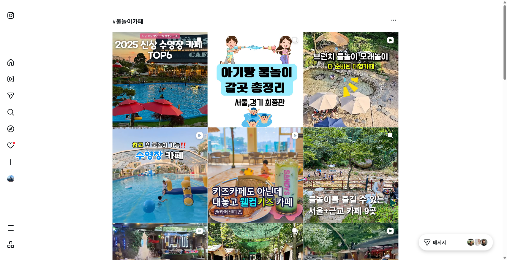
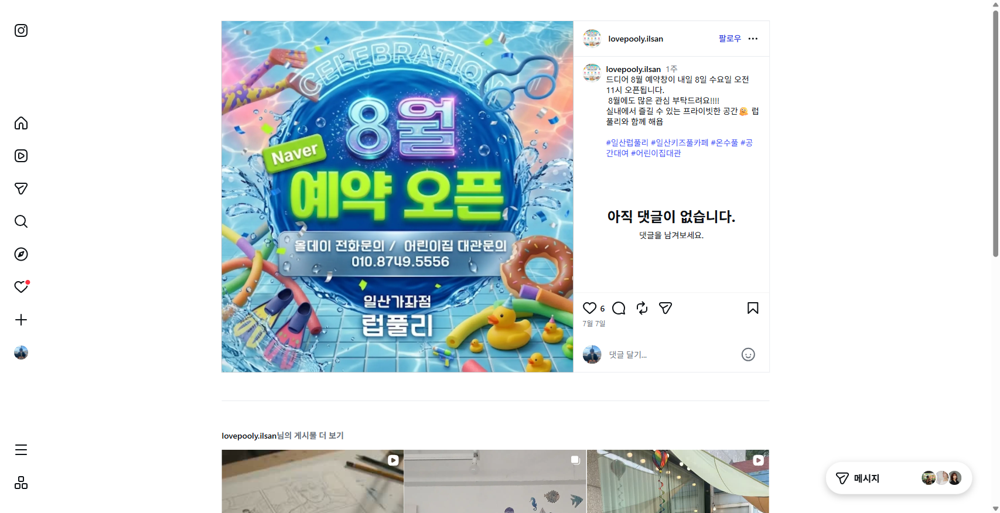
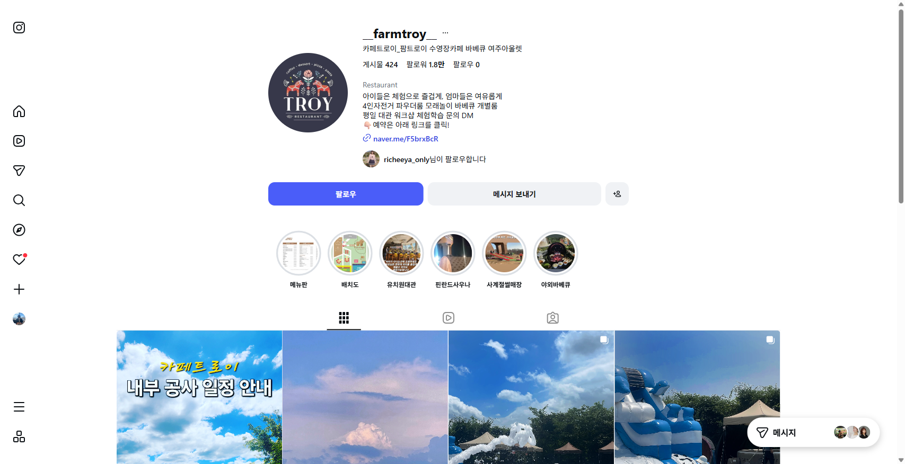
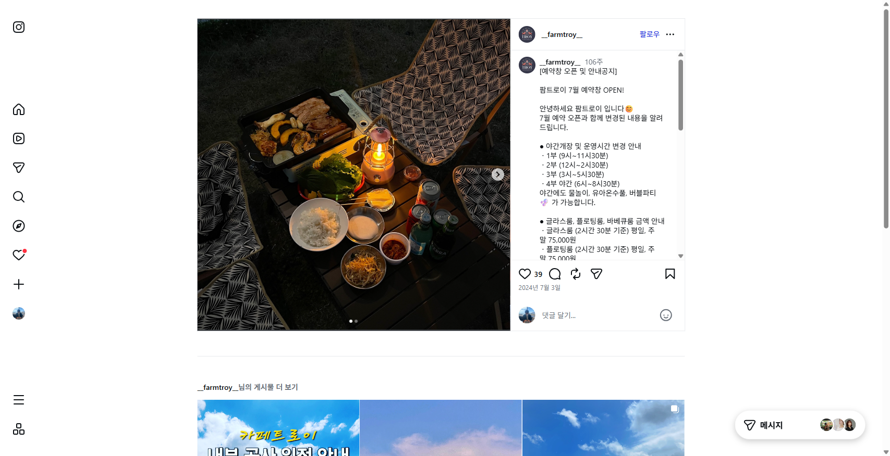
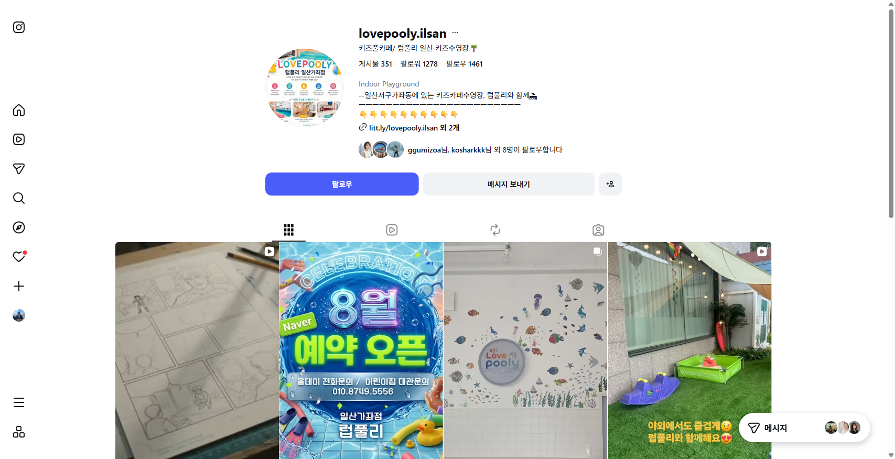
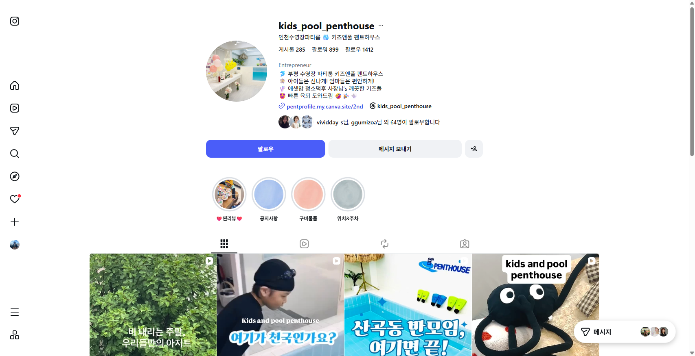
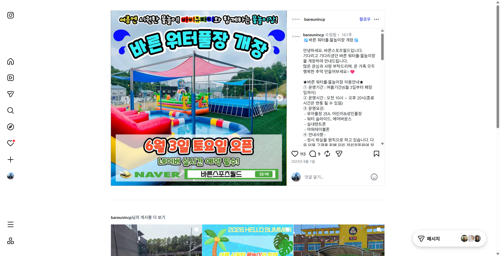
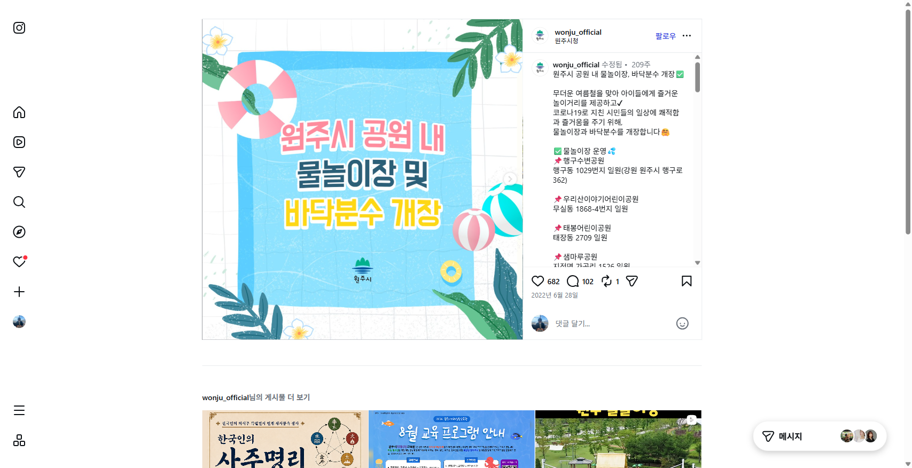
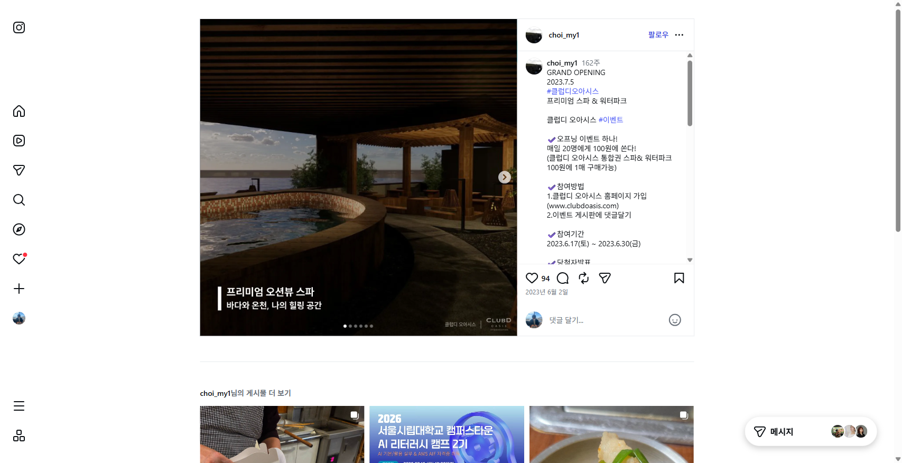
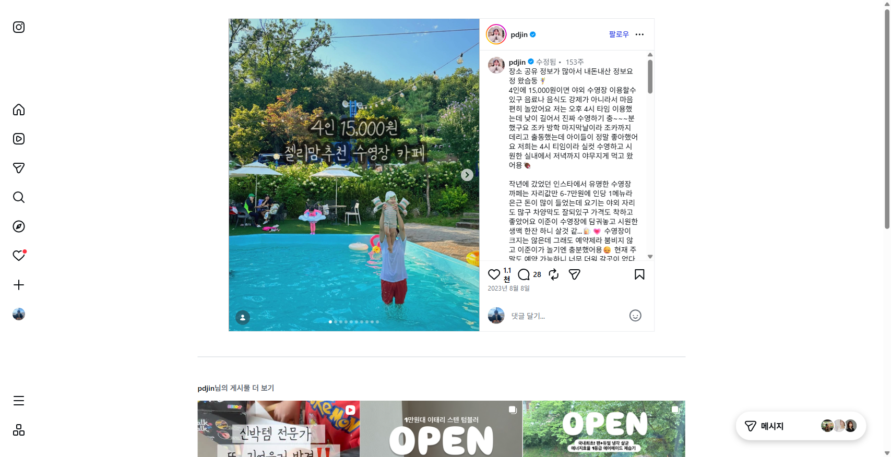

# 🌊 물놀이 카페·식당 SNS 포스터 레퍼런스

> 놀담 **여름 실내 물놀이장 개장** 포스터([`../poster.md`](../poster.md)) 제작을 위한 레퍼런스 모음.
> **수집일** 2026-07-16 · **방법** Playwright로 인스타그램 로그인 후 직접 탐색 · **초점** *물놀이장을 운영하는 카페·식당의 **공식 계정이 올린 홍보 포스터***

---

## 📌 수집 방법 & 선별 기준

1. `#물놀이카페` `#물놀이키즈카페` `#베이비풀카페` `#키즈풀카페` `#수영장카페` `#물놀이터카페` 등 해시태그의 **인기 게시물 178개**를 참여지표(좋아요·댓글)순으로 수집.
2. 처음엔 좋아요·댓글이 폭발한 게시물이 **대부분 방문자·맘블로거의 후기 릴스(동영상)** 였음 → **업체 자체 계정의 포스터**로 방향 전환.
3. 계정 검색 + 프로필 조회로 **실제 물놀이 업체 공식 계정**을 선별해, 그들이 올린 **디자인 홍보 포스터(이미지)** 를 캡처.

> ⚠️ 업체 공식 계정의 포스트는 방문자 바이럴 릴스(좋아요 수천)보다 **좋아요 수가 낮음(6~96)** — 계정 규모가 작기 때문. 그래서 업체 레퍼런스는 **좋아요 수보다 '계정 규모·포스터 디자인 완성도'** 로 골랐고, 바이럴 게시물의 **주제**는 아래 〈시장 신호〉로 따로 분석했습니다.

---

## 🏆 업체 계정 포스터 레퍼런스

### 00 · `#물놀이카페` 검색 그리드 (개관 + 탐색 증빙)

로그인 후 `#물놀이카페`(게시물 3.9만) 실제 검색 화면. 썸네일 자체가 포스터 문법 — **"2025 신상 수영장 카페 TOP6"**, **"브런치·물놀이·모래놀이 다 준비된 대형카페"**, **"하교 후 물놀이 가능‼️ 수영장 카페"**, **"대놓고 웰컴키즈 카페"**. 공통점: **① 큰 굵은 후킹 문구 ② 채도 높은 컬러 한 방 ③ 물/수영장 실사**.

---

### 04 · ⭐ 럽풀리(일산 키즈풀카페) — "8월 예약 오픈" 포스터 〔핵심 레퍼런스〕

- **계정** `@lovepooly.ilsan` · 키즈풀카페 / 일산 키즈수영장 · Indoor Playground · 팔로워 1,278 · 게시물 351
- **게시물** "드디어 8월 예약창이 내일 오픈… 실내에서 즐길 수 있는 프라이빗 공간" · `#일산키즈풀카페 #온수풀 #공간대여 #어린이집대관`

**왜 핵심인가** — 우리가 만들 **"물놀이장 개장/예약 오픈"** 포스터와 목적이 100% 일치.
**디자인 문법(그대로 벤치마크):**
- 배경 = **풀장 물 실사**(잔물결·물빛) 풀블리드
- 핵심 문구 **`8월` `예약 오픈`** 을 초대형 **3D 메탈릭 타이포**로 (메시지 하나에 시선 집중)
- **`Naver` 초록 pill 배지**로 예약 채널 즉시 표시
- 실버 인포바에 **`전화·대관 문의 010-…`** → CTA를 눈에 띄게
- 하단에 **지점명·브랜드** 고정
- 오리·튜브·물총·도넛튜브·물방울 데코로 **여름·물놀이 감성**

---

### 01 · 팜트로이(여주 수영장카페·바베큐) — 프로필

- **계정** `@__farmtroy__` · 카페트로이_팜트로이 수영장카페 바베큐 · **Restaurant** · **팔로워 1.8만** · 게시물 424
- **소개** "아이들은 체험으로 즐겁게, 엄마들은 여유롭게 / 파우더룸·모래놀이·바베큐 개별룸"
- **참고점** — 스토리 하이라이트를 **메뉴판·배치도·유치원대관·야외바베큐**로 정보 구획화. 피드 첫 칸이 **"내부 공사 일정 안내" 디자인 공지 포스터**(하늘 배경+노랑 타이포) → 업체가 공지를 **포스터화**하는 방식의 좋은 예. 물미끄럼틀·풀 실사도 확인.

### 02 · 팜트로이 — "예약창 OPEN" 공지 게시물

- **게시물** "[예약창 오픈 및 안내공지] 팜트로이 7월 예약창 OPEN!" (좋아요 39)
- **참고점** — 리드 이미지는 실사(바베큐)지만, **캡션이 곧 정보 포스터**: *야간개장 1~4부 운영시간 / 글라스룸·플로팅룸·바베큐룸 금액 / 야간에도 물놀이·유아온수풀·버블파티 가능*. → **개장 포스터에 담을 정보 항목(운영시간대·가격·부대시설)** 체크리스트로 유용.

---

### 03 · 럽풀리 — 프로필 (포스터 일관성)

피드 그리드에서 **아쿠아 톤 포스터가 브랜드 시그니처로 반복**됨(예약 오픈·여름 공지). 벽면 물고기 데코, 야외 잔디+수박 풀 등 **공간 실사와 디자인 포스터가 번갈아** 배치되는 운영 방식.

### 05 · 키즈앤풀 펜트하우스(인천 수영장 파티룸) — 프로필

- **계정** `@kids_pool_penthouse` · 인천 수영장파티룸 · 팔로워 899 · 프로필 링크가 **Canva 사이트**(디자인 지향 업체)
- **참고점** — "아이들은 신나게! 엄마들은 편안하게!" 카피 = **놀담 "아이는 놀고, 어른은 쉬고"와 동일한 소구점**. 릴스 썸네일도 **굵은 후킹 문구 + 물 실사** 문법(예: "산곡동 반모임, 여기면 끝!").

---

## 🆕 물놀이장 "개장" + 실사 사진 레퍼런스 〔핵심 보강〕

우리 포스터의 목적 = **여름 물놀이장 개장 + 실제 물놀이장 사진**. 이에 딱 맞는 개장/오픈 게시물을 개장 특화 해시태그(`#물놀이장개장` `#물놀이개장` `#워터파크개장` `#실내물놀이장`)로 보강했습니다.

### 07 · ⭐ 바른스포츠월드 — "워터풀·물놀이장 개장" (실사) 〔최우선 벤치마크〕

- **계정** `@bareunincp` (바른스포츠월드) · 좋아요 113
- **실제 물놀이장 사진**(에어바운스·유아풀 2EA·워터슬라이드·그늘막 텐트) 위에 텍스트 오버레이
- 상단 후킹 *"여름엔 시원한 물놀이! 바비큐파티와 함께하는 물놀이장!"* + **"바른 워터풀장 개장"** 초대형 타이포
- 하단 배너 **"6월 3일 토요일 오픈 · 네이버 실시간 예약 필수! · NAVER [바른스포츠월드] 검색"**
- **가장 직접적인 벤치마크** — 실사 + 개장 문구 + 운영정보(캡션: 운영기간·시간·시설) + 예약 CTA가 한 장에.

### 06 · 원주시청 — "물놀이장·바닥분수 개장" (공식 디자인 포스터)

- **계정** `@wonju_official` (원주시청) · 682♥ / 102💬
- 일러스트 풀장 배경 + **"원주시 공원 내 / 물놀이장 및 / 바닥분수 개장"** 굵은 아웃라인 타이포 + 튜브·비치볼 데코
- 공공기관 개장 공지 포스터의 정석 — 개장 위치·운영정보를 캡션에 리스트업.

### 08 · 클럽디 오아시스 — "GRAND OPENING" 스파&워터파크 (실사)

- **계정** `@choi_my1` (클럽디 오아시스) · 94♥
- 실사 오션뷰 스파/풀 사진 + *"프리미엄 오션뷰 스파"* 서브카피 + 브랜드 로고
- **"GRAND OPENING 날짜 + 오프닝 이벤트(선착순·할인) + 참여방법·기간"** 구조 → 개장 이벤트 카피 설계에 참고.

### 09 · 카페 수영장 (실사 + 가격 오버레이)

- **계정** `@pdjin` (정보 크리에이터 · 업체 아님) · **1,108♥** / 28💬
- **실사 야외 카페 수영장** 위 **"4인 15,000원 · 젤리맘 추천 수영장 카페"** 오버레이
- *놀담과 동일한 '카페 + 수영장 + 가격' 맥락* — 실사 위 **가격 한 줄**이 얼마나 강한 훅인지 보여줌(놀담 개장 특가 15,000원 표기에 직접 참고).

---

## 📈 시장 신호 — 바이럴 게시물이 알려주는 것 (참여 178건 분석)

업체 포스터는 아니지만, **좋아요·댓글이 폭발한 방문자 게시물의 '주제'** 가 곧 소비자가 반응하는 훅입니다:

| 좋아요 | 댓글 | 주제 | 시사점 |
|--:|--:|:--|:--|
| 5,642 | 1,009 | **"물놀이터 개장하고 다녀옴" + "유아 입장료 5천원의 행복"** | **개장 소식 + 명확한 입장료**가 최강 훅 |
| 4,587 | 315 | "아기랑 물놀이 갈곳 총정리" (정보형) | 정보 큐레이션 수요 큼 |
| 4,218 | 229 | 부산 칼국수집+카페 **바다뷰 물놀이** | 식당도 '물놀이'로 후킹 |
| 1,097 | 1,315 | "워터파크 + 키즈카페" | 복합(놀이+물놀이) 소구 |
| 952 | 1,758 | **"무료 물놀이장 + 실내놀이터"** | 실내·가성비가 댓글 폭발 |

**핵심 결론 3가지**
1. **"개장/오픈" 그 자체가 뉴스** — 큰 글씨로 못박기.
2. **입장료·특가를 명확한 숫자로** — "유아 입장료 5천원" 류가 저장·공유를 부름.
3. **실내·안심** 앵글이 여름 무더위·안전 걱정과 맞물려 강하게 먹힘.

---

## 🎯 놀담 물놀이장 개장 포스터에 적용할 시사점

레퍼런스를 종합하면, 우리 포스터([`../poster.md`](../poster.md)) 방향과 정확히 맞습니다:

- **레이아웃** — 럽풀리처럼 **물 실사 풀블리드 + 초대형 핵심 문구 하나**. (poster.md의 "사진 62% + 카피 밴드" 구조와 동일 결.)
- **포인트 컬러** — 업체 포스터 다수가 **아쿠아/블루**를 메인으로 씀 → poster.md의 포인트색 `#00B4D8` 선택이 시장 문법과 일치. 단, 놀담은 **크림/세이지 base를 유지**해 흔한 수영장 광고와 차별화.
- **카피** — "개장/OPEN"을 크게, **입장료·특가 숫자를 또렷하게**(개장 특가 15,000원, 2주 한정), CTA(예약·문의)를 인포바로.
- **차별점** — 레퍼런스들은 대체로 원색·클립아트가 강함 → 놀담은 **"감각적인데 안심되는"** 톤(뮤트 base + 절제된 아쿠아 포인트 + 아이 얼굴 비식별)으로 **한 단계 위 브랜딩**을 노릴 수 있음.

---

## 🗂 파일 목록

| 파일 | 계정 | 유형 |
|:--|:--|:--|
| `00_인스타검색_물놀이카페_그리드.png` | `#물놀이카페` | 검색 그리드(개관·증빙) |
| `01_팜트로이_수영장카페_프로필.png` | `@__farmtroy__` | 업체 프로필 |
| `02_팜트로이_예약오픈공지.png` | `@__farmtroy__` | 예약 오픈 공지 |
| `03_럽풀리_키즈풀카페_프로필.png` | `@lovepooly.ilsan` | 업체 프로필 |
| `04_럽풀리_8월예약오픈_포스터.png` ⭐ | `@lovepooly.ilsan` | **예약 오픈 디자인 포스터** |
| `05_키즈앤풀펜트하우스_프로필.png` | `@kids_pool_penthouse` | 업체 프로필 |
| `06_원주시청_물놀이장개장_공식포스터.png` | `@wonju_official` | **물놀이장 개장** 공식 포스터(일러스트) |
| `07_바른스포츠월드_워터풀개장_실사.png` ⭐ | `@bareunincp` | **물놀이장 개장 + 실사** (최우선 벤치마크) |
| `08_클럽디오아시스_그랜드오픈_실사.png` | `@choi_my1` | GRAND OPENING + 실사(스파/풀) |
| `09_카페수영장_실사_4인15000원.png` | `@pdjin` | 카페 수영장 실사 + 가격 오버레이 |

*출처: 각 업체의 공개 인스타그램 계정. 참고·벤치마크 용도이며, 디자인을 그대로 복제하지 않고 놀담 브랜드로 재해석합니다.*
