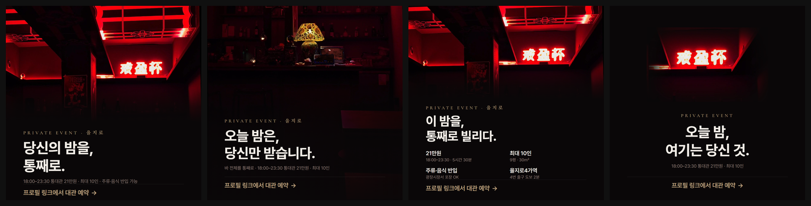
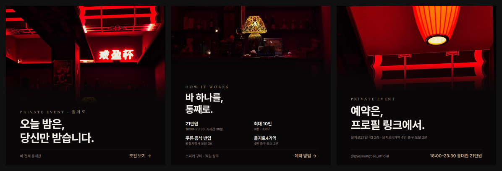

# 계영배 인스타그램 통대관 광고 카드

> **제작일** 2026-07-19 · 1080×1080 · 목적 **통대관(바 전체 대관)**
> 규격 [`card.md`](./card.md) · 브랜드 분석 [`brand/BRAND.md`](./brand/BRAND.md) · 값 [`brand/brand.json`](./brand/brand.json)
> 빌드 [`build.py`](./build.py) — 색·폰트·**대관 조건까지 전부 `brand.json`에서 읽는다**


*실제 피드 크기(400px)로 축소한 4종 — v2 / A 몰입형 / B 정보형 / C 미니멀*

---

## 대관 조건 (카드에 반영된 값)

| 항목 | 값 |
|---|---|
| **시간** | **18:00–23:30** (5시간 30분) |
| **요금** | **21만원** (통대관 정액) |
| **인원** | **최대 10인** |
| 면적 | 9평 · 30㎡ |
| 반입 | 주류·음식 반입 가능 (광장시장 포장 OK) |
| 위치 | 을지로4가역 4번 출구 도보 2분 |
| 예약 | spacecloud.kr/space/52157 (프로필 링크) |

> 🔴 **스페이스클라우드 등록정보 갱신이 필요합니다.**
> 현재 등록: `최소 3시간부터 · ₩13,000 / 패키지` — 위 조건과 다릅니다.
> 광고에서 21만원을 보고 예약 페이지에서 다른 금액을 보면 이탈합니다. **카드 집행 전에 맞춰주세요.**

---

## 결과물

| 안 | 파일 | 카피 | 언제 쓰나 |
|---|---|---|---|
| **v2** ⭐ | `card_gyeyoungbae_2026-07-19_v2.jpg` | 당신의 밤을, 통째로. | **기본.** 상시 운용 |
| **A** | `..._alt-a.jpg` | 오늘 밤은, 당신만 받습니다. | 분위기로 설득할 때 |
| **B** | `..._alt-b.jpg` | 이 밤을, 통째로 빌리다. | 예약 직전 검토자용 |
| **C** | `..._alt-c.jpg` | 오늘 밤, 여기는 당신 것. | 브랜딩·리타게팅 |
| v1 | `..._v1.jpg` | (CTA=DM, 가격 없음) | 보관용 |

소스는 `card-*.html`, 사진 소재는 `assets/`, 검수 이미지는 `renders/check-*`.

---

## 3장 캐러셀



| 장 | 파일 | 역할 | 카피 |
|---|---|---|---|
| **1/3** | `carousel_gyeyoungbae_2026-07-19_1.jpg` | **후킹** — 스와이프를 얻는 것이 전부 | 오늘 밤은, 당신만 받습니다. |
| **2/3** | `..._2.jpg` | **본문** — 조건을 표로 | 바 하나를, 통째로. |
| **3/3** | `..._3.jpg` | **CTA** — 예약 경로 | 예약은, 프로필 링크에서. |

### 세 장을 한 세트로 묶은 방법

캐러셀은 **한 장씩 잘 만드는 것보다 세 장이 같은 물건으로 보이는 게 먼저**입니다. 아래를 전부 고정했습니다.

| 고정한 것 | 값 |
|---|---|
| 구조 | 상단 사진 밴드 + 하단 검정 밴드 (3장 공통) |
| 여백 | 좌우 96px |
| 정렬 | **전부 왼쪽** — 장마다 정렬이 바뀌면 세트로 안 읽힌다 |
| 타입 스케일 | 키커 26 / 카피 66~78 / 보조 25 / 푸터 30 |
| 팔레트 | 배경·잉크·앰버 + 사진 속 네온 (카드 4종과 동일) |

### 캐러셀에서만 다르게 한 것

- **1장에 조건을 넣지 않았습니다.** 후킹 장의 유일한 임무는 스와이프를 얻는 것입니다. 숫자를 먼저 보여주면 넘길 이유가 사라집니다
- **1장은 그리드 썸네일로도 남습니다.** 프로필 그리드에 남는 건 1장뿐이라 가장 강한 컷(단청 천장 + 네온)을 배치했습니다
- **1·2장 우하단에 다음 장을 볼 이유**를 뒀습니다 — `조건 보기 →`, `예약 방법 →`. 3장에는 두지 않습니다(끝이므로)
- **3장은 카피 자체가 CTA**입니다. `예약은, 프로필 링크에서.` 아래에 CTA 줄을 또 두면 같은 말을 두 번 하게 됩니다

### 이 과정에서 잡은 버그

**한글 키커에 라틴용 자간이 걸려 자모가 벌어졌습니다.** 2장 키커를 `이렇게 빌립니다`로 넣었더니 `.kicker`의 `letter-spacing: .34em`(라틴 세리프 전용) 때문에 **"이 렇 게  빌 립 니 다"** 로 읽혔습니다.
→ 세 장 모두 라틴 키커로 통일 (`Private Event` / `How It Works` / `Private Event`). 브랜드가 이미 *"How to Get Gyeyoungbae"* 같은 영문 헤드를 쓰고 있어 톤에도 맞습니다.

> **업로드 순서 주의** — 인스타 캐러셀은 **선택한 순서대로** 올라갑니다. 파일명 끝 숫자(1·2·3) 순서로 넣어주세요.

---

## 4안 비교

| | v2 | A 몰입형 | B 정보형 | C 미니멀 |
|---|---|---|---|---|
| 어절 | 3 | 3 | 3 | 4 |
| 비주얼 | 단청 천장 + 네온 (60%) | 빈 바 전체 (풀블리드) | 와이드 밴드 (48%) | 네온 단독 (작게) |
| 레이아웃 | 하단 밴드 | 풀블리드 + 스크림 | 하단 밴드 + 2×2 스펙 | 여백형 |
| 조건 노출 | 1줄 (시간·요금·인원·반입) | 1줄 (시간·요금·인원) | **표 4칸** | 1줄 (시간·요금·인원) |
| 잉크 커버리지 | 6.7% | 6.8% | 6.2% | 5.7% |
| JPG | 162KB | 135KB | 159KB | 91KB |

**추천 = v2.** 공간감과 조건을 한 장에 담으면서 `card.md` §5 여백 규칙을 지키는 균형점입니다.
C는 가장 고급스럽지만 정보가 얇아 단독으로 신규 고객을 데려오긴 어렵습니다. **v2로 알리고 C로 각인**시키는 조합을 권합니다.
B는 문의가 실제로 들어오기 시작했을 때, 조건을 미리 걸러주는 용도로 붙이면 응대 시간이 줄어듭니다.

---

## 이번에 내린 판단

### 1. 가격을 시간과 함께 붙였다

`21만원`만 쓰면 비싸게 읽힙니다. **`18:00–23:30 통대관 21만원`** 으로 붙이면 5시간 30분·바 전체라는 가치가 같이 전달됩니다.
10인 기준 **1인 21,000원** — 캡션에서 쓸 만한 각도입니다.

### 2. B안에서 중복을 걷어냈다

- 카피가 `9평, 최대 10인, 통째로.`였는데 **아래 표가 같은 숫자를 다시 말하고 있었습니다** → `이 밤을, 통째로 빌리다.`로 교체
- 스펙 부제 `주류·음식 반입 / 콜키지 가능`은 같은 말의 반복 → `광장시장서 포장 OK`로 교체해 새 정보를 얹었습니다

### 3. 파란 화면을 지웠다 (A안)

카운터 위 노트북·태블릿·어항이 **카드에서 유일한 한색**이라 붉은 톤과 충돌했습니다. 해당 픽셀(전체의 0.93%)만 붉은 조명 아래 어두운 물체로 보정했습니다.
직원 업무 장비를 지운 것이라 **대관 상품의 실체를 왜곡하지 않습니다.** 공간 구조·집기·조명은 그대로입니다.

### 4. C안 네온 테두리 — CSS 마스크를 버리고 이미지에 구웠다

`mask-image: radial-gradient(115% 108% ..., #000 44%, transparent 78%)`는 **44% 스톱이 이미 박스 가장자리**여서 페이드가 시작되기도 전에 잘렸습니다. 사각 테두리가 남은 원인입니다.
CSS 대신 PIL에서 **안쪽으로 들여 그린 라운드 사각 + 가우시안 블러 72**로 페더링을 구워 넣었습니다. 가장자리가 배경색 `#0A0708`으로 수렴합니다.

### 5. 레드는 끝까지 CSS로 칠하지 않았다

4안 모두 카피 밴드에 레드가 **한 픽셀도 없습니다.** 레드는 전부 사진 속 실제 네온입니다.
(`#A40703`는 검정 배경 대비 2.49:1로 대형 텍스트 기준 미달 — `brand/BRAND.md` §2)

---

## 검수 결과 (4안 공통 ✅)

| 항목 | 결과 |
|---|---|
| 피드에 섞었을 때 | ✅ `check-in-feed.png` — 실제 게시물 8개와 3×3 합성, 이질감 없음 |
| 400px 축소 가독 | ✅ `compare-feed400.png` — 가격·시간까지 읽힘 |
| 폰트 로드 | ✅ Pretendard — Malgun Gothic 대비 텍스트 폭 **117px 차이**로 확인 |
| 1080×1080 · sRGB | ✅ |
| 바깥 여백 96px | ✅ |
| 카피 3~7어절 | ✅ 3~4어절 |
| 요소 5개 이하 | ✅ |
| 잉크 커버리지 30% 이하 | ✅ 5.7~6.8% |
| CTA 1개 · 경로 지정 | ✅ `프로필 링크에서 대관 예약 →` |
| 대비 (카피/CTA/보조) | ✅ 17.24 / 8.37 / 5.07 : 1 |
| JPG 재압축 띠 | ✅ 최대 계단 0~5 |

> alt-a의 계단 5는 그라데이션이 아니라 **사진 내용**(선반·병)입니다. 측정 열이 글자나 피사체를 지나가면 값이 무의미해지므로 글자 없는 구간만 재야 합니다.

---

## 다음 단계

1. **스페이스클라우드 등록정보 갱신** — 위 🔴 참고. 카드 집행 전 필수
2. **캡션 초안** — 필요하시면 씁니다. 후기의 *"앨범 리스닝 파티"*, *"술집 다 빌려놓고 노는 느낌"*, *"광장시장에서 안주 포장"* 이 좋은 훅이고, 스피커·콜키지 가능도 소구점입니다

## 재생성

```bash
py build.py     # 4종 HTML 재생성 — 가격·인원을 바꾸려면 brand.json의 rental만 고치면 된다
```

```powershell
& "C:\Program Files\Google\Chrome\Application\chrome.exe" `
  --headless=new --disable-gpu --hide-scrollbars `
  --screenshot="$PWD\renders\card-v2.png" `
  --window-size=1080,1080 --force-device-scale-factor=1 `
  --virtual-time-budget=10000 `
  --user-data-dir="$env:TEMP\cp-gyb-새이름" `
  "$PWD\card-v2.html"
```

- 🔴 `--user-data-dir`은 **호출마다 새 이름**으로. 재사용하면 오류 없이 PNG가 안 만들어진다
- 🔴 PowerShell에서 `Get-ChildItem` 등과 `C:\Program` 경로를 **한 명령에 섞으면** 샌드박스가 조용히 막는다. 렌더와 파일 확인은 따로 실행할 것
